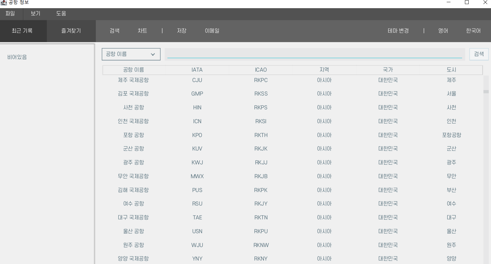
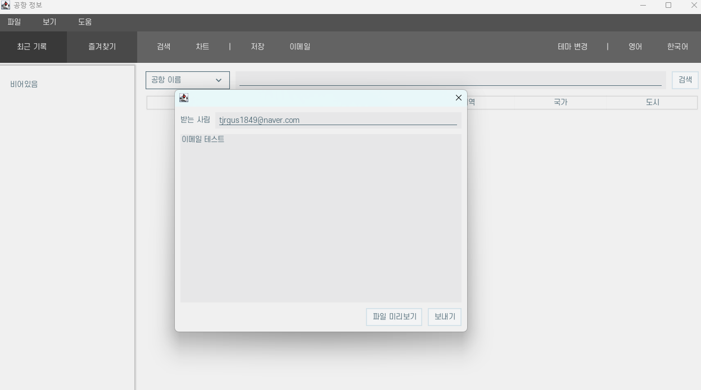
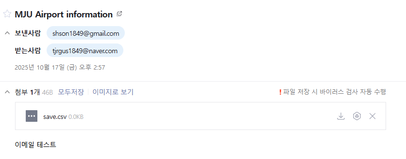
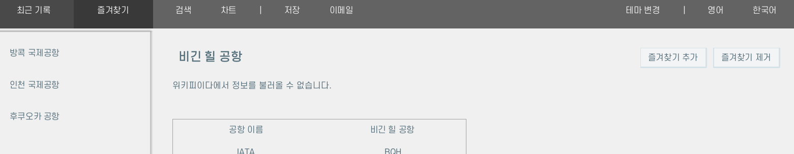

# AirportInfo

**공공데이터포털 | 국토교통부 세계공항 정보**  
[데이터 출처](https://www.data.go.kr/data/3051587/fileData.do)

---

## 개요

**AirportInfo**는 전 세계 공항 정보를 조회하고,  
즐겨찾기 및 최근 검색 내역을 관리할 수 있는 **Java 17 기반 Swing 애플리케이션**입니다.  
CSV 또는 DB(MySQL)와 연동하여 데이터를 관리하며,  
검색・저장・그래프 시각화 등의 기능을 제공합니다.

## 주요 기능

### 1. 설정
- **일반**
  - 영어만 지원될 경우 번역 체크박스  
  - 검색 기록 초기화  
  - 즐겨찾기 초기화  
  - DB 업데이트
- **저장**
  - 현재 언어만 저장 체크박스  
  - 기본 공항 정보 저장 방식 선택 (CSV / JSON)
- **차트 설정**
  - 차트 라벨 보기  
  - 보조선 보기  
  - 간격 설정

### 2. 검색
- IATA 코드, ICAO 코드, 공항 이름, 지역, 국가, 도시 등 다양한 기준으로 공항 검색 가능

### 3. 최근 기록
- 최근 검색한 공항 정보 시각화

### 4. 즐겨찾기
- 자주 조회하는 공항 정보 저장 및 관리

### 5. 이메일
- 내용과 파일을 이메일로 전송

### 6. 저장
- CSV 또는 JSON 형식으로 파일 저장

### 7. 차트
- 공항 관련 통계 데이터를 시각적으로 확인

---

## 추가 기능
- 테마 변경: Black / White  
- 언어 지원: 영어 / 한국어

### 메인 화면

### 이메일 화면
- 이메일 보내기 화면:  

- 이메일 전송 결과 화면:  

### 즐겨찾기 화면

### 최근기록 화면

